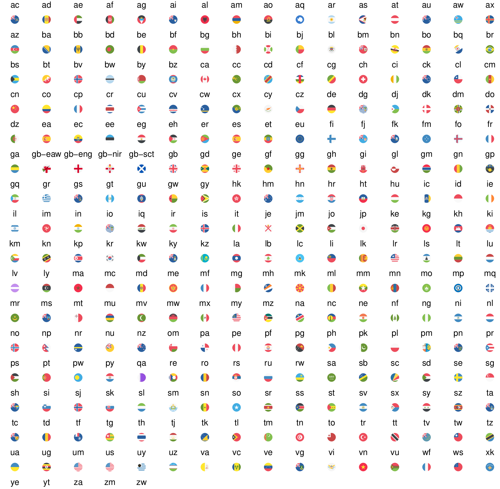

<!-- README.md is generated from README.Rmd. Please edit that file -->

```{r, include = FALSE}
knitr::opts_chunk$set(
  collapse = TRUE,
  comment = "#>",
  fig.path = "man/figures/README-",
  out.width = "100%"
)
```

## ggflags: Plot flags of the world in ggplot2

A flag geom for ggplot2. Uses circular SVG flags.

# Install

Install from R-Universe:

```r
install.packages("ggflags", repos = c(
  "https://jimjam-slam.r-universe.dev",
  "https://cloud.r-project.org"))
```

# Use

```{r demo, warning=FALSE}
library(ggplot2)
library(ggflags)

set.seed(1234)
d <- data.frame(
  x = rnorm(50), y = rnorm(50),
  country = sample(c("ar", "fr", "nz", "gb", "es", "ca", "lv", "qa"), 50, TRUE),
  stringsAsFactors = FALSE
)

ggplot(d, aes(x = x, y = y, country = country, size = x)) +
  geom_flag() +
  scale_country() +
  scale_size(range = c(0, 15))
```

The flag SVG assets, used under the [CC-BY licence](https://github.com/eosrei/emojione-color-font/blob/master/LICENSE-CC-BY.txt), are taken from the EmojiOne set: https://github.com/eosrei/emojione-color-font

(Note: the EmojiOne set doesn't include UK counties or US states!)



(note: proof of principle only)
