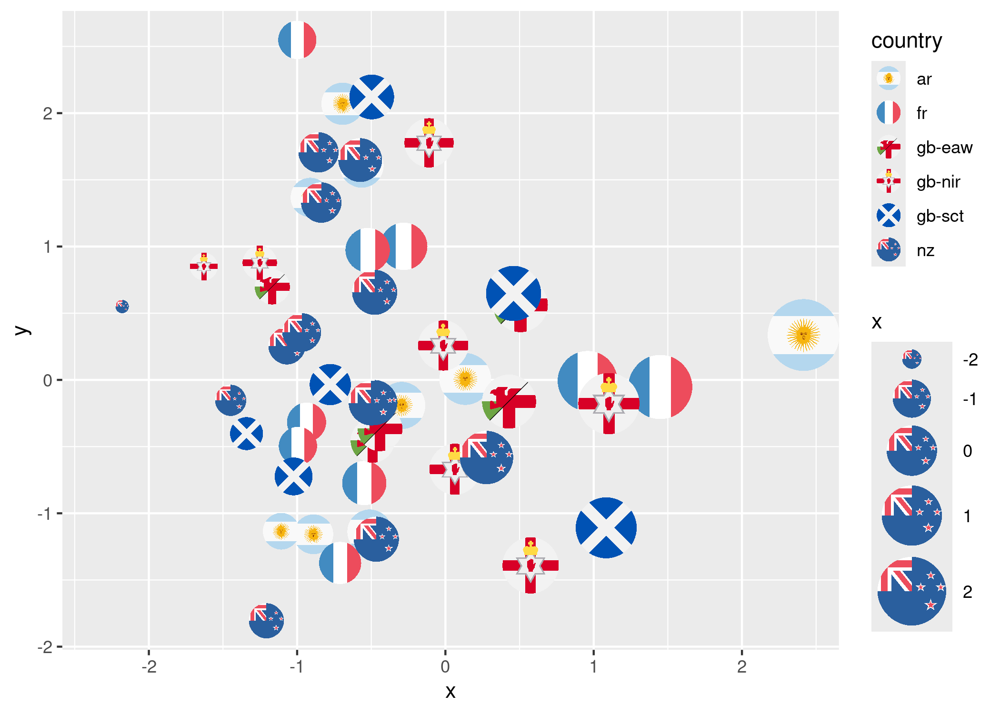
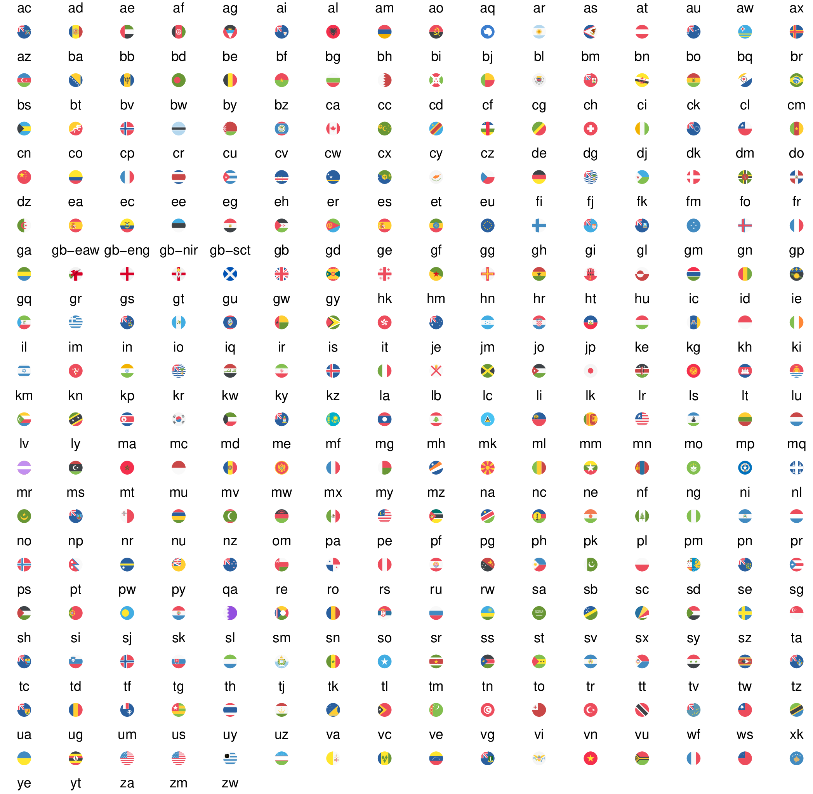

<!-- README.md is generated from README.Rmd. Please edit that file -->

## ggflags

flag geom for ggplot2

``` r
library(ggflags)
#> Loading required package: ggplot2

set.seed(1234)
d <- data.frame(
  x = rnorm(50), y = rnorm(50),
  country = sample(c("ar", "fr", "nz", "gb", "es", "ca", "lv", "qa"), 50, TRUE),
  stringsAsFactors = FALSE
)
ggplot(d, aes(x = x, y = y, country = country, size = x)) +
  geom_flag() +
  scale_country() +
  scale_size(range = c(0, 15))
```



The flag SVG assets, used under the [CC-BY
licence](https://github.com/eosrei/emojione-color-font/blob/master/LICENSE-CC-BY.txt),
are taken from the EmojiOne set:
<https://github.com/eosrei/emojione-color-font>

(Note: the EmojiOne set doesn’t include UK counties or US states!)



(note: proof of principle only)
